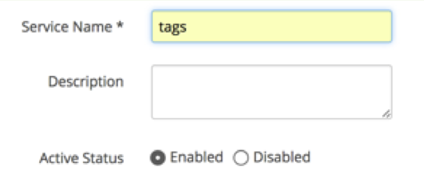
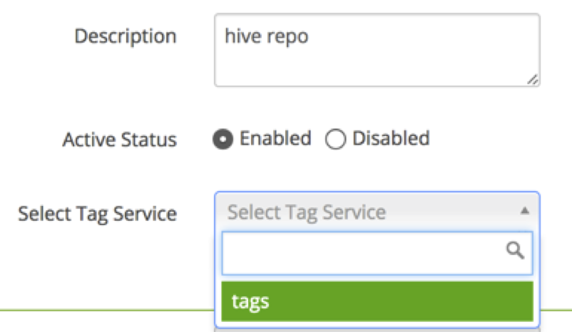
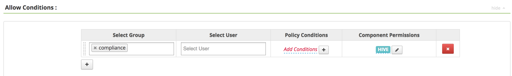
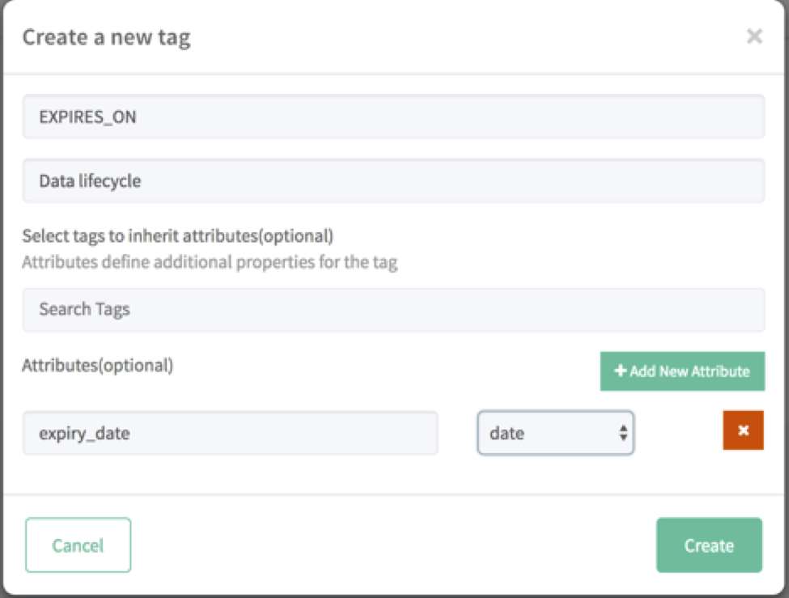
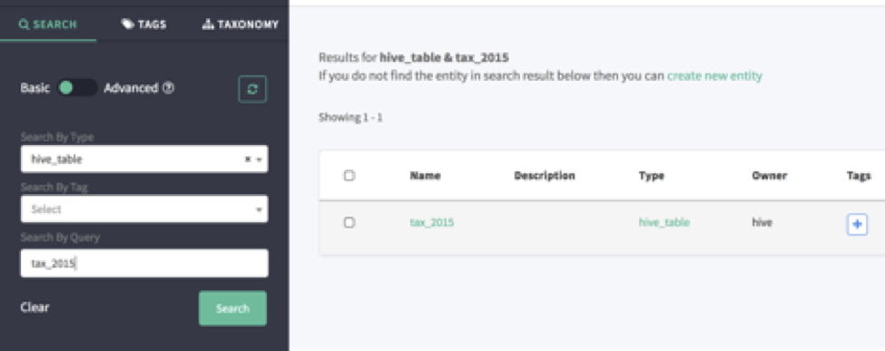
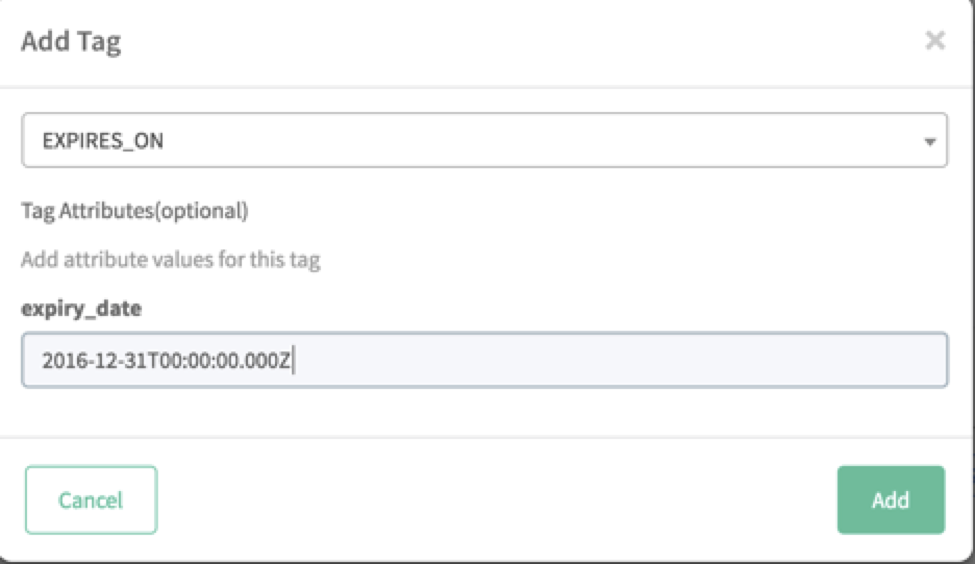

# Ranger Atlas (Hortonia Bank)

## Lab 01: Access services

Ensure you can access the following.

- [ ] Ambari: Login to Ambari web UI by opening http://AMBARI_PUBLIC_IP:8080
- Open each of the following from Ambari:
  - [ ] Ranger
  - [ ] Atlas
  - [ ] Zeppelin

Credentials will be provided by the instructor.

## Lab 02: Ranger: Review & Enable HortoniaBank Policies

- Open Ranger
- View the Hive policies.
  - Note that the demo policies are disabled.
- [ ] Enable them while reviewing what they do.
  - Make sure to do this for each type (Access, Masking, Row Level Filter)

## Lab 03: Ranger: Enable Tag based Policies

- [ ] Create Tag Service
  - Open Ranger
  - Click Access Manager -> Tag Based Policies
  - Click the + icon and create a service named 'tags'
    - 

- [ ] Configure Hive for Tag based Policies
  - Open Ranger
  - Click Access Manager -> Resources Based Policies
  - Click ‘edit/pen’ icon next to the service’
  - [ ] Set ‘Select Tag Service’ to ‘tags’
    - 

## Lab 04: Ranger: Allow 'compliance' group to see expired data

- [ ] Update 'EXPIRES_ON' tag based policy
  - Open Ranger
  - Click Access Manager -> Tag Based Policies
  - Open the 'tags' service
  - Edit the 'EXPIRES_ON' policy
  - Notice the condition which denies access to 'public'
  - Add these conditions:
    - 1. 'Allow Conditions': Give the group 'compliance' access to component 'hive'
      - 
    - 2. 'Exclude from Deny Conditions': Give the group 'compliance' access to component 'hive'
      - 

## Lab 05: Atlas: Create 'EXPIRES_ON' tag in Atlas

- [ ] Create tag in Atlas
  - Open Atlas
  - Click ‘Tags’ -> ‘Create Tag’
  - Name: "EXPIRES_ON"
    - Attributes: "expiry_date" as type "date"
    - 

## Lab 06: Atlas: Add 'EXPIRES_ON' tag to table 'tax_2015'

1. [ ] Find the 'tax_2015' table
  - Open Atlas
  - Click ‘Search’:
    - Type: hive_table
    - Query: tax_2015
      - 
2. [ ] Add tag to table
  - Click blue "+" sign next to 'tax_2015'
    - Tag: EXPIRES_ON
    - expiry_date: 2016-12-31T00:00:00.000Z
      - 

## Lab 07: Test policies from Ambari

For each task below:
- Login as the user specified
- Execute the queries listed.

1. Login as ivana-eu-hr
  - [ ] Execute this query which shows EU country row filtering
    ```
SELECT surname, streetaddress, country, countryfull, age, password, nationalid, ccnumber, mrn, birthday
FROM hortoniabank.ww_customers LIMIT 50;
    ```

1. Login as joe-analyst
  - [ ] Execute this query which shows data masking
    ```
SELECT surname, streetaddress, age, password, nationalid, ccnumber, mrn, birthday
FROM hortoniabank.us_customers LIMIT 20;
    ```
  - [ ] Execute this query
    ```
select gender, title, givenname, streetaddress, city, state, country from hortoniabank.ww_customers
limit 100;
    ```
  - [ ] Execute this query to test denied row combinations
    ```
select givenname, surname, emailaddress, zipcode, mrn, bloodtype
from hortoniabank.ww_customers
limit 50;
    ```
  - [ ] Execute this query to confirm access denied for tax_2015
    ```
select * from finance.tax_2015;
    ```

1. Login as kate-hr
  - [ ] Execute this query to show no data masking
    ```
SELECT surname, streetaddress, age, password, nationalid, ccnumber, mrn, birthday
FROM hortoniabank.us_customers LIMIT 20;
    ```
  - [ ] Execute this query to test that you only get US data
    ```
select givenname, surname, emailaddress, zipcode, mrn, bloodtype
from hortoniabank.ww_customers
limit 50;
    ```

2.	Login as compliance-admin
- [ ] Execute this query to confirm access to expired data
    ```
select * from finance.tax_2015;
    ```

## Lab 08: Review Ranger audits

- [ ] Check Ranger audits
  - Open Ranger
  - Click Audit
    - Notice, in the far right column, the '[EXPIRES_ON]' tag policy being used
    - Review the other audit logs for row level filtering and row masking.

## Lab 09: Import Zeppelin Notebooks

- [ ] Import Notebooks
  - Login to Zeppelin
  - Import each of these notebooks using URL
    - [ ] [HortoniaBank - compliance-admin Notebook](https://raw.githubusercontent.com/seanorama/masterclass/master/ranger-atlas/Notebooks/HortoniaBank%20-%20Compliance%20Admin%20View.json)
    - [ ] [HortoniaBank - ivana-eu-ur Notebook](https://raw.githubusercontent.com/seanorama/masterclass/master/ranger-atlas/Notebooks/HortoniaBank%20-%20Ivana%20EU%20HR.json)
    - [ ] [HortoniaBank - joe-analyst Notebook](https://raw.githubusercontent.com/seanorama/masterclass/master/ranger-atlas/Notebooks/HortoniaBank%20-%20Joe%20Analyst.json)
